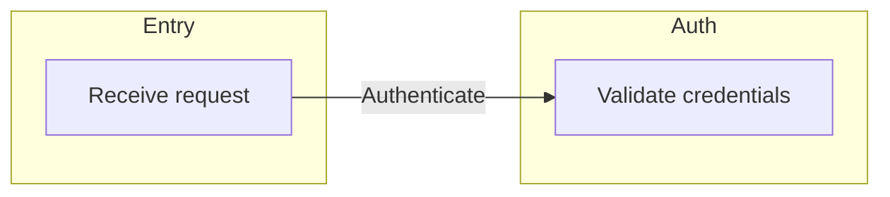
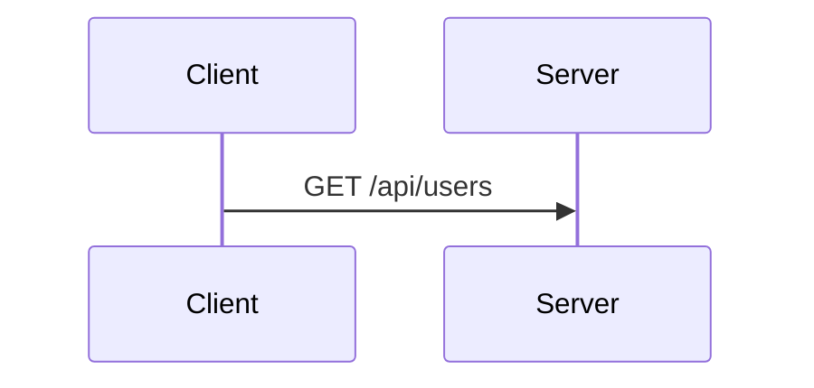
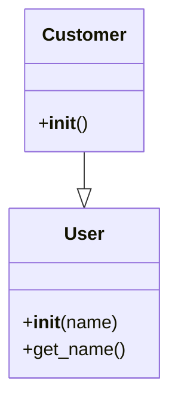
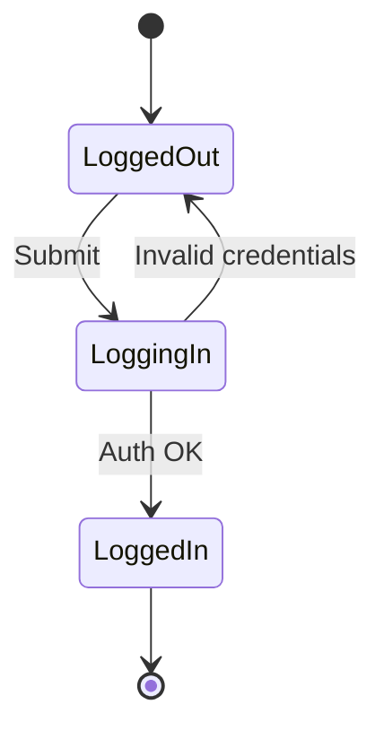
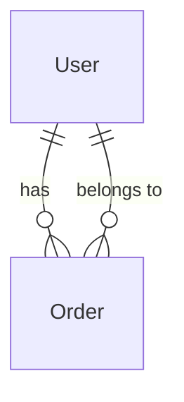

# MAD — Mermaid Auto-Doccing

## How it works

MAD transforms `//@` comments into Mermaid code automatically. The parser reads the file, extracts nodes and connections, and generates the final diagram.

## Fundamental rules

1. **File's first line**: `//@::DiagramType` defines the diagram type.
2. **`//@` comments**: become nodes or connections in the diagram.
3. **`//` comments without `@`**: Remove.
4. **Documentation must stay in code**: NEVER create separate documentation files (`.md`, `.txt`, etc.) outside the source code. Tags are placed over the code they represent.

## Supported diagram types

```typescript
//@::graph LR          // Flowchart (left → right)
//@::graph TD          // Flowchart (top → bottom)
//@::sequenceDiagram   // Sequence diagram
//@::classDiagram      // Class diagram
//@::stateDiagram-v2   // State machine
//@::erDiagram         // Entity-relationship diagram
```

## Naming system

### Simple nodes (without numbers)
```typescript
//@Auth        // Group/class without numbering
```
- **Groups**: become `subgraph` in flowchart or classes in classDiagram
- **Participants**: become participants in sequenceDiagram

### Numbered nodes
```typescript
//@Auth1             // First step of Auth group
//@Auth1.1           // Sub-step of Auth1
//@Auth1.1.2         // Sub-sub-step
```

**Numbering rules:**
- `Name1` → entry node (first level)
- `Name1.1` → sequence of previous node
- `Name1.1.2` → third level of depth
- Nodes are automatically sorted by number

### Custom labels
```typescript
//@Auth1:Authenticate user    // Node with custom label
//@Auth1.1:Verify 2FA         // Sub-step with label
```

## Defining nodes

### Rule
```
| Tags |  Description | 
|:---|---:|
| //@ | defines a node with ID and optional label |
| //@-> | defines an arrow pointing to a node using it's ID | 

`TAG+ID:Label` → defines a node with ID `ID` and label `Label`.

Examples:
  `//@Login1:Receive request` → Node ID: `Login1`, Label: `Receive request`
  `//@->Auth1:Authenticate` → Connection from current context to node `Auth1` with label `Authenticate`
```

### Flowchart
```typescript
//@::graph LR

//@Entry                    // Root group
class LoginController {
  //@Entry1:Receive request    // Node inside group
  async login() {
    //@->Auth1:Authenticate    // Connection (see Connections section)
  }
}

//@Auth                     // Another group
class AuthService {
  //@Auth1:Validate credentials
}
```

**Generates:**


### Sequence Diagram
```typescript
//@::sequenceDiagram

//@Client
class ApiClient {
  //@Client1:Send request
  async fetch() {
    //@->Server:GET /api/users
  }
}

//@Server
class UserService {
  //@Server1:Process data
}
```

**Generates:**


### Class Diagram
```python
#@::classDiagram

#@User
class User:
    #@User1:__init__
    def __init__(self, name):
        pass
    
    #@User1.1:get_name
    def get_name(self):
        pass

#@Customer
class Customer(User):
    #@<|--User:inherits from
    #@Customer1:__init__
```

**Generates:**


### State Diagram
```typescript
//@::stateDiagram-v2

//@LoggedOut
class LoggedOutState {
  //@LoggedOut1:Show form
  showForm() {}
}

//@LoggingIn
class LoggingInState {
  //@LoggingIn1:Authenticate
  authenticate() {
    //@->LoggedIn:Success
    //@->LoggedOut:Failure
  }
}

//@LoggedIn
class LoggedInState {
  //@LoggedIn1:Show dashboard
}

// Connections between states (outside classes)
//@LoggedOut->LoggingIn:Submit
//@LoggingIn->LoggedIn:Auth OK
//@LoggingIn->LoggedOut:Invalid credentials
```

**Generates:**


### ER Diagram
```sql
--@::erDiagram

--@User
CREATE TABLE users (
  id INT PRIMARY KEY,
  name VARCHAR(150)
);

--@Order
CREATE TABLE orders (
  id INT PRIMARY KEY,
  user_id INT
);

-- Relationships (separate lines)
--@User->Order:has
--@Order->User:belongs to
```

**Generates:**


### Class Diagram connections

```typescript
//@::classDiagram

//@User
class User {
  //@User1:__init__
}

//@Address
class Address {
  //@Address1:__init__
}

// UML relationships
//@User-->Address:has              // Association
//@Customer<|--User:inherits       // Inheritance
//@Order*--OrderItem:contains      // Composition
//@CartItem o--Product:references  // Aggregation
```

**Relationship types:**
- `-->` — Association (solid line)
- `<|--` — Inheritance/generalization (empty triangle)
- `*--` — Composition (filled diamond)
- `o--` — Aggregation (empty diamond)

### Sequence Diagram connections

```typescript
//@::sequenceDiagram

//@Client
class ApiClient {
  //@Client1:Request data
  async fetch() {
    //@->Server:Request user       // Standard sync arrow
    //@->>Database:SQL query       // Sync arrow (same as ->)
  }
}
```

## Connections in detail

### Two types of connections

**1. Implicit source (`//@->Target:label`)**
```typescript
// The source is the CURRENT CONTEXT (the nearest numbered node above)
//@Entry1:Start
//@->Auth1:Validate token    // Source = Entry1
//@->Database1:Fetch data    // Source = Entry1
```

**2. Explicit source (`//@Source->Target:label`)**
```typescript
// The source is EXPLICITLY defined
//@Entry->Auth:Main flow     // Source = Entry group
//@Auth->Database:Query      // Source = Auth group
```

### When to use each

| Type | When to use | Example |
|------|-------------|---------|
| `//@->Target` | Inside a function/method, connecting from the current step | `//@->Auth1:Authenticate` inside `Entry1` |
| `//@Source->Target` | Outside any function, connecting groups or explicit flows | `//@Entry->Auth:Main flow` at file level |

### Rule of thumb
- Inside a method body → use `//@->Target`
- At class/file level (between groups) → use `//@Source->Target`

## Conventions and patterns

### 1. One node per responsibility
```typescript
// ✅ Good
//@Auth1:Validate credentials
//@Auth1.1:Verify 2FA

// ❌ Bad
//@Auth1:Validate credentials AND verify 2FA AND create session
```

### 2. Short names, descriptive labels
```typescript
// ✅ Good
//@DB1:Fetch user by ID

// ❌ Bad
//@DatabaseServiceFindUserByIdFromDatabaseWithJoins1
```

### 3. **CRITICAL: Tags must lead to actual code**
```typescript
// ✅ Good - Tags eventually lead to code
//@Entry
class LoginController {
  //@Entry1:Handle login
  async handleLogin(email, password) {
    //@->Auth1:Authenticate
    //@->Auth2:Validate input
    await auth.authenticate(email, password);
    //@->Dashboard1:Show dashboard
    return dashboard.show();
  }
}

// ❌ Bad - Tags without any code (floating)
//@Entry1:Handle login
//@->Auth1:Authenticate
//@->Dashboard1:Show dashboard
// (no actual code below any tag)
```

**Rule**: Tags can be nested/grouped together, but they MUST eventually be followed by actual code (function body, class definition, etc.). A sequence of tags without any code implementation is invalid. Only one ID Tag is allowed per node.

**Allowed patterns:**
```typescript
// ✅ OK - Multiple tags then code
//@Process1:Validate
const result = validate(data);
//@Process2:Transform
const transformed = transform(result);
//@Process3:Save
save(transformed);
//@Process4:Close
//@->Process1:Restart
dispose(result);
```

```
// ✅ OK - Tags inside class with implementation
//@Auth
class AuthService {
  //@Auth1:Login
  //@Auth1.1:Verify 2FA
  async login() {
    await verify2FA();
  }
}
```

**Forbidden patterns:**
```typescript
// ❌ BAD - Only tags, no code
//@Entry1:Start
//@->Process1:Do something
//@->Process2:Do something else

// ❌ BAD - Tags at file level without context
//@Auth1:Login
//@Auth2:Logout
// (no class/function containing these tags)
```

### 4. Number hierarchy
```typescript
// Correct structure:
//@Feature1          // First level
//@Feature1.1        // Second level (child of Feature1)
//@Feature1.1.1      // Third level (child of Feature1.1)

// Avoid gaps:
//@Feature1
//@Feature1.3        // ❌ Skipped 1.1 and 1.2
```

## Examples

See the `examples/` folder for complete, real-world implementations:

| File | Type | Description |
|------|------|-------------|
| `01-flowchart-login.ts` | Flowchart | Login flow with auth, 2FA, rate limiting |
| `02-sequence-api.js` | Sequence | API request/response flow |
| `03-class-diagram-oop.py` | Class | OOP inheritance and composition |
| `04-state-machine-login.js` | State | Login state machine with transitions |
| `05-er-database.sql` | ER | Database entity relationships |

## Step-by-step guide for the agent

### Order of insertion (CRITICAL)

When adding MAD tags to code, follow this EXACT order:

```
Step 1: Define diagram type on first line
    //@::graph LR

Step 2: Define GROUPS (simple nodes without numbers)
    //@Entry
    //@Auth
    //@Dashboard

Step 3: Define NUMBERED NODES inside each group
    //@Entry1:Handle login
    //@Auth1:Authenticate
    //@Auth2:Create session

Step 4: Define CONNECTIONS between nodes
    //@->Auth1:Authenticate       (inside method)
    //@Entry->Auth:Main flow      (at file level)

Step 5: VALIDATE (see validation flow below)
    cat /tmp/mad-diagram.mermaid
```

### Progressive refactoring (recommended approach)

Do NOT add all tags at once. Add them progressively, validating at each step:

```typescript
// ITERATION 1: Just the type and groups
//@::graph LR
//@Entry
//@Auth
//@Dashboard
// → Validate: should see 3 groups

// ITERATION 2: Add numbered nodes
//@Entry1:Handle login
//@Auth1:Authenticate
//@Auth2:Create session
//@Dashboard1:Show dashboard
// → Validate: should see 4 nodes inside groups

// ITERATION 3: Add connections
//@->Auth1:Authenticate
//@->Auth2:Create session
//@->Dashboard1:Show dashboard
// → Validate: should see connections between nodes

// ITERATION 4: Add code implementation
class LoginController {
  async login() {
    //@->Auth1:Authenticate
    await auth.authenticate();
  }
}
// → Validate: final diagram complete
```

### How to decide where to place each tag

| Tag type | Placement | Example |
|----------|-----------|---------|
| `//@Group` | Above class/group definition | `//@Auth` above `class AuthService` |
| `//@Group1:Label` | Above method/function | `//@Auth1:Login` above `async login()` |
| `//@Group1.1:Label` | Inside method, above specific step | `//@Auth1.1:Verify 2FA` inside `login()` |
| `//@->Target:Label` | Inside method, at the point of call | `//@->Dashboard1:Show` where dashboard is called |
| `//@Source->Target:Label` | At file level, between groups | `//@Entry->Auth:Main flow` |

## Validation flow (for AI agents)

When you insert or modify MAD tags, you MUST validate the generated diagram by following this flow:

### How the validation works

1. You insert/modify `//@` tags in the code
2. Save the file (the user can do `Cmd+S` or you can request them to save)
3. The VS Code extension automatically detects the save and generates the Mermaid diagram
4. The diagram is saved to `/tmp/mad-diagram.mermaid` (always overwritten, never duplicated)
5. **YOU read this file** to validate the result:
   ```bash
   cat /tmp/mad-diagram.mermaid
   ```
6. Verify the diagram matches what the tags should produce
7. If incorrect: adjust the tags, save again, and re-validate
8. If correct: deliver the final tags + validated diagram

### File location

| Aspect | Detail |
|--------|--------|
| Path | `/tmp/mad-diagram.mermaid` |
| Type | Single file, always **overwritten** (not duplicated) |
| Trigger | Auto-generated on file save (`onDidSaveTextDocument`) |
| Generator | VS Code extension command `mad.generateDiagram` |
| Extension | Updates automatically without your intervention |

### What TO DO

```typescript
// 1. Insert/modify MAD tags in the code
// 2. Save the file (request user to save if needed)
// 3. Read the generated diagram:
//    cat /tmp/mad-diagram.mermaid
// 4. Validate the output
// 5. If wrong → adjust tags → save again → re-validate
// 6. If correct → deliver tags + diagram
```

### What NOT TO DO

- ❌ Do NOT create or maintain a separate validation script
- ❌ Do NOT try to generate diagrams manually (the extension does it automatically)
- ❌ Do NOT look for the diagram anywhere else (it's always at `/tmp/mad-diagram.mermaid`)
- ❌ Do NOT use `Date.now()` or timestamps — use the fixed path to avoid duplicates

### Iterative refinement loop

When the diagram doesn't match expectations:

```
1. Identify what's missing or incorrect in the output
2. Fix the related `//@` tags in the source code
3. Save the file (Cmd+S)
4. Read the updated diagram: cat /tmp/mad-diagram.mermaid
5. Verify again
6. Repeat until the diagram is correct
```

### After completion (self-validation)

After finishing a task with MAD tags, the agent MUST validate its own work:

1. Read `/tmp/mad-diagram.mermaid`
2. Verify:
   - All groups are present
   - All numbered nodes are present
   - All connections are correct
   - Labels match the intended meaning
   - Flow makes logical sense
3. If anything is wrong, fix the tags and re-validate
4. Only deliver the result after successful validation

## Quick checklist

When writing MAD tags, verify:

- [ ] First line is `//@::type`?
- [ ] Every important node has `//@`?
- [ ] Tags eventually lead to actual code (not just floating tags)?
- [ ] Nodes are correctly numbered (1, 1.1, 1.1.1)?
- [ ] Labels are short and descriptive?
- [ ] Flow is clear and concise?
- [ ] Tagging rules were all followed?
- [ ] Diagram was validated via `/tmp/mad-diagram.mermaid`?
- [ ] Diagram matches what the tags should produce?
- [ ] Followed the order: type → groups → numbered nodes → connections?
- [ ] Validated progressively (not all at once)?