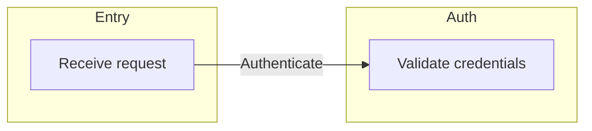
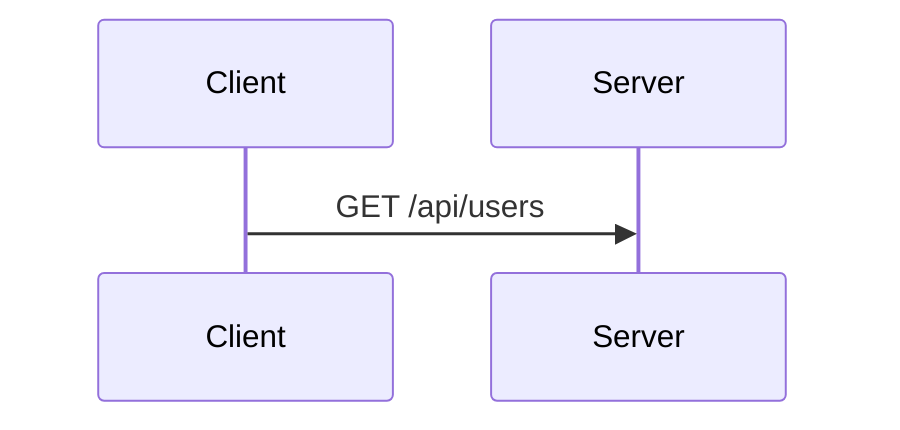
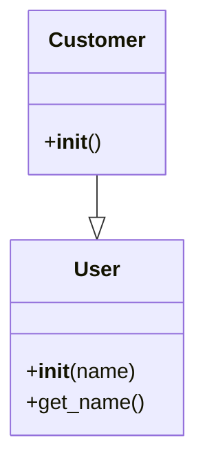
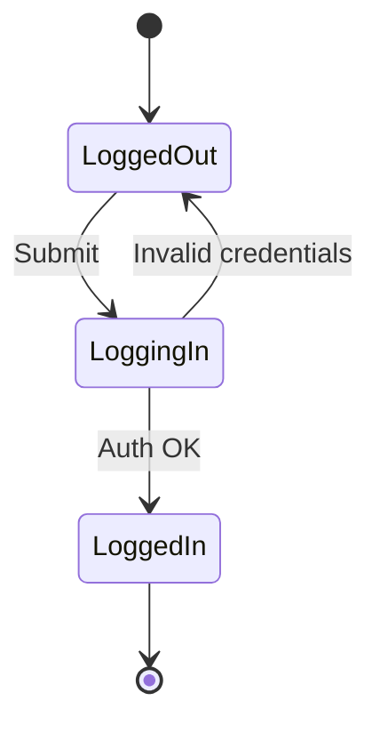
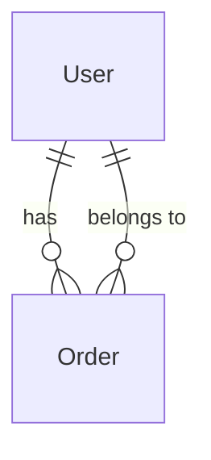

# MAD — Mermaid Auto-Doccing

## How it works

MAD transforms `//@` comments into Mermaid code automatically. The parser reads the file, extracts nodes and connections, and generates the final diagram.

## Fundamental rules

1. **File's first line**: `//@::DiagramType` defines the diagram type.
2. **`//@` comments**: become nodes or connections in the diagram.
3. **`//` comments without `@`**: AVOID.
4. **Documentation must stay in code**: NEVER create separate documentation files (`.md`, `.txt`, etc.) outside the source code. Tags are placed over the code they represent.

## Supported diagram types

```typescript
//@::graph LR          // Flowchart (left → right)
//@::graph TD          // Flowchart (top → bottom)
//@::sequenceDiagram   // Sequence diagram
//@::classDiagram      // Class diagram
//@::stateDiagram-v2   // State machine
//@::erDiagram         // Entity-relationship diagram
```

## Naming system

### Simple nodes (without numbers)
```typescript
//@Auth        // Group/class without numbering
```
- **Groups**: become `subgraph` in flowchart or classes in classDiagram
- **Participants**: become participants in sequenceDiagram

### Numbered nodes
```typescript
//@Auth1             // First step of Auth group
//@Auth1.1           // Sub-step of Auth1
//@Auth1.1.2         // Sub-sub-step
```

**Numbering rules:**
- `Name1` → entry node (first level)
- `Name1.1` → sequence of previous node
- `Name1.1.2` → third level of depth
- Nodes are automatically sorted by number

### Custom labels
```typescript
//@Auth1:Authenticate user    // Node with custom label
//@Auth1.1:Verify 2FA         // Sub-step with label
```

## Defining nodes

### Rule
```
| Tags |  Description | 
|:---|---:|
| //@ | defines a node with ID and optional label |
| //@-> | defines an arrow pointing to a node using it's ID | 

`TAG+ID:Label` → defines a node with ID `ID` and label `Label`.

Examples:
  `//@Login1:Receive request` → Node ID: `Login1`, Label: `Receive request`
  `//@->Auth1:Authenticate` → Connection from current context to node `Auth1` with label `Authenticate`
```

### Flowchart
```typescript
//@::graph LR

//@Entry                    // Root group
class LoginController {
  //@Entry1:Receive request    // Node inside group
  async login() {
    //@->Auth1:Authenticate    // Connection (see Connections section)
  }
}

//@Auth                     // Another group
class AuthService {
  //@Auth1:Validate credentials
}
```

**Generates:**


### Sequence Diagram
```typescript
//@::sequenceDiagram

//@Client
class ApiClient {
  //@Client1:Send request
  async fetch() {
    //@->Server:GET /api/users
  }
}

//@Server
class UserService {
  //@Server1:Process data
}
```

**Generates:**


### Class Diagram
```python
#@::classDiagram

#@User
class User:
    #@User1:__init__
    def __init__(self, name):
        pass
    
    #@User1.1:get_name
    def get_name(self):
        pass

#@Customer
class Customer(User):
    #@<|--User:inherits from
    #@Customer1:__init__
```

**Generates:**


### State Diagram
```typescript
//@::stateDiagram-v2

//@LoggedOut
class LoggedOutState {
  //@LoggedOut1:Show form
  showForm() {}
}

//@LoggingIn
class LoggingInState {
  //@LoggingIn1:Authenticate
  authenticate() {
    //@->LoggedIn:Success
    //@->LoggedOut:Failure
  }
}

//@LoggedIn
class LoggedInState {
  //@LoggedIn1:Show dashboard
}

// Connections between states (outside classes)
//@LoggedOut->LoggingIn:Submit
//@LoggingIn->LoggedIn:Auth OK
//@LoggingIn->LoggedOut:Invalid credentials
```

**Generates:**


### ER Diagram
```sql
--@::erDiagram

--@User
CREATE TABLE users (
  id INT PRIMARY KEY,
  name VARCHAR(150)
);

--@Order
CREATE TABLE orders (
  id INT PRIMARY KEY,
  user_id INT
);

-- Relationships (separate lines)
--@User->Order:has
--@Order->User:belongs to
```

**Generates:**


**Practical examples:**

```typescript
//@::graph LR

//@Entry
class Controller {
  //@Entry1:Start
  start() {
    //@->Auth1:Validate token      // Source: Entry1 (current context)
    //@->Database1:Fetch data     // Another connection from same context
  }
}

//@Auth
class AuthService {
  //@Auth1:Verify JWT
}

//@Database
class DatabaseService {
  //@Database1:SQL query
}

//@Entry->Auth:Main flow         // Explicit source: Entry group
//@Auth->Database:Query data     // Explicit source: Auth group
```

### Class Diagram connections

```typescript
//@::classDiagram

//@User
class User {
  //@User1:__init__
}

//@Address
class Address {
  //@Address1:__init__
}

// UML relationships
//@User-->Address:has              // Association
//@Customer<|--User:inherits       // Inheritance
//@Order*--OrderItem:contains      // Composition
//@CartItem o--Product:references  // Aggregation
```

**Relationship types:**
- `-->` — Association (solid line)
- `<|--` — Inheritance/generalization (empty triangle)
- `*--` — Composition (filled diamond)
- `o--` — Aggregation (empty diamond)

### Sequence Diagram connections

```typescript
//@::sequenceDiagram

//@Client
class ApiClient {
  //@Client1:Request data
  async fetch() {
    //@->Server:Request user       // Standard sync arrow
    //@->>Database:SQL query       // Sync arrow (same as ->)
  }
}
```

## Conventions and patterns

### 1. One node per responsibility
```typescript
// ✅ Good
//@Auth1:Validate credentials
//@Auth1.1:Verify 2FA

// ❌ Bad
//@Auth1:Validate credentials AND verify 2FA AND create session
```

### 2. Short names, descriptive labels
```typescript
// ✅ Good
//@DB1:Fetch user by ID

// ❌ Bad
//@DatabaseServiceFindUserByIdFromDatabaseWithJoins1
```

### 3. **CRITICAL: Tags must lead to actual code**
```typescript
// ✅ Good - Tags eventually lead to code
//@Entry
class LoginController {
  //@Entry1:Handle login
  async handleLogin(email, password) {
    //@->Auth1:Authenticate
    //@->Auth2:Validate input
    await auth.authenticate(email, password);
    //@->Dashboard1:Show dashboard
    return dashboard.show();
  }
}

// ❌ Bad - Tags without any code (floating)
//@Entry1:Handle login
//@->Auth1:Authenticate
//@->Dashboard1:Show dashboard
// (no actual code below any tag)
```

**Rule**: Tags can be nested/grouped together, but they MUST eventually be followed by actual code (function body, class definition, etc.). A sequence of tags without any code implementation is invalid. Only one ID Tag is allowed per node.

**Allowed patterns:**
```typescript
// ✅ OK - Multiple tags then code
//@Process1:Validate
const result = validate(data);
//@Process2:Transform
const transformed = transform(result);
//@Process3:Save
save(transformed);
//@Process4:Close
//@->Process1:Restart
dispose(result);
```

```
// ✅ OK - Tags inside class with implementation
//@Auth
class AuthService {
  //@Auth1:Login
  //@Auth1.1:Verify 2FA
  async login() {
    await verify2FA();
  }
}
```

**Forbidden patterns:**
```typescript
// ❌ BAD - Only tags, no code
//@Entry1:Start
//@->Process1:Do something
//@->Process2:Do something else

// ❌ BAD - Tags at file level without context
//@Auth1:Login
//@Auth2:Logout
// (no class/function containing these tags)
```

### 4. Number hierarchy
```typescript
// Correct structure:
//@Feature1          // First level
//@Feature1.1        // Second level (child of Feature1)
//@Feature1.1.1      // Third level (child of Feature1.1)

// Avoid gaps:
//@Feature1
//@Feature1.3        // ❌ Skipped 1.1 and 1.2
```

## Common patterns

### HTTP request flow
```typescript
//@::graph LR

//@Entry
class ApiController {
  //@Entry1:Receive request
  handle(req, res) {
    //@->Middleware1:Validate auth
    //@->Service1:Process
    //@->Response1:Return JSON
  }
}

//@Middleware
class AuthMiddleware {
  //@Middleware1:Verify JWT
}

//@Service
class BusinessService {
  //@Service1:Execute logic
}

//@Response
class ResponseHandler {
  //@Response1:Format output
}
```

### State cycle
```typescript
//@::stateDiagram-v2

//@Idle
class IdleState {
  //@Idle1:Waiting for event
}

//@Processing
class ProcessingState {
  //@Processing1:Working
  work() {
    //@->Idle:Completed
    //@->Error:Failed
  }
}

//@Error
class ErrorState {
  //@Error1:Log error
  handle() {
    //@->Idle:Retry
  }
}

//@Idle->Processing:Start
//@Processing->Error:Exception
//@Error->Idle:Recover
```

### Complex relationships (ER)
```sql
--@::erDiagram

--@User
CREATE TABLE users (id INT PRIMARY KEY, name VARCHAR(150));

--@Order
CREATE TABLE orders (id INT PRIMARY KEY, user_id INT);

--@Product
CREATE TABLE products (id INT PRIMARY KEY, name VARCHAR(250));

--@OrderItem
CREATE TABLE order_items (id INT PRIMARY KEY, order_id INT, product_id INT);

-- Relationships
--@User||--o{Order:places
--@Order||--|{OrderItem:contains
--@Product||--o{OrderItem:references
```

## Quick checklist

When writing MAD tags, verify:

- [ ] First line is `//@::type`?
- [ ] Every important node has `//@`?
- [ ] Tags eventually lead to actual code (not just floating tags)?
- [ ] Nodes are correctly numbered (1, 1.1, 1.1.1)?
- [ ] Labels are short and descriptive?
- [ ] Flow is clear and concise?
- [ ] Tagging rules were all followed?