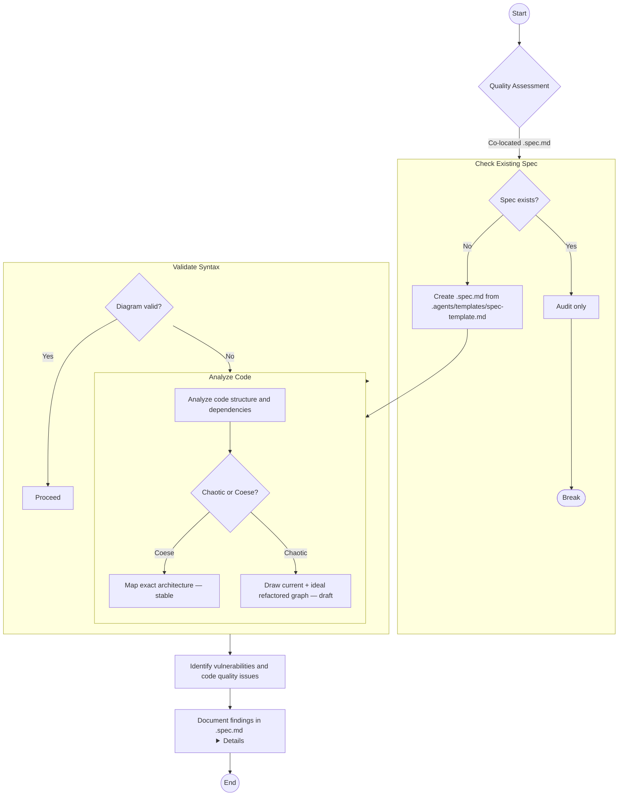
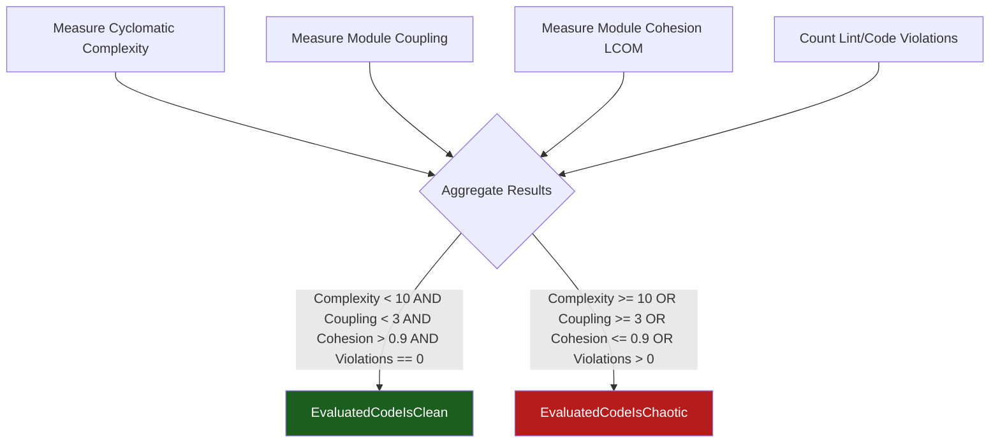

```mermaid
%% @spec-version v1.3.3
graph TD
    Start((Start)) --> Evaluation{Quality Assessment}

    Evaluation -->|Co-located .spec.md| MakeSpec

    subgraph MakeSpec[Check Existing Spec]
        direction TB
        M1{Spec exists?}
        M1 -->|No| M2[Create .spec.md from .agents/templates/spec-template.md]
        M1 -->|Yes| M3[Audit only]
        M3 --> Break([Break])
    end

    M2 --> RenderTopology

    subgraph RenderTopology[Analyze Code]
        direction TB
        R1[Analyze code structure and dependencies]
        R1 --> R2{Chaotic or Coese?}
        R2 -->|Coese| R3[Map exact architecture — stable]
        R2 -->|Chaotic| R4[Draw current + ideal refactored graph — draft]
    end

    RenderTopology --> CheckDiagram

    subgraph CheckDiagram[Validate Syntax]
        direction TB
        C1{Diagram valid?}
        C1 -->|Yes| C2[Proceed]
        C1 -->|No| RenderTopology
    end

    CheckDiagram --> D[Identify vulnerabilities and code quality issues]
    D --> W[Document findings in .spec.md <details> block]
    W --> End((End))
```

```mermaid
%% @spec-version v1.3.0
%% Decision Matrix for EvaluatedCodeIsClean vs EvaluatedCodeIsChaotic
flowchart TD
    M[Measure Cyclomatic Complexity] --> A{Aggregate Results}
    C[Measure Module Coupling] --> A
    H[Measure Module Cohesion LCOM] --> A
    V[Count Lint/Code Violations] --> A

    A -->|Complexity < 10 AND Coupling < 3 AND Cohesion > 0.9 AND Violations == 0| Clean[EvaluatedCodeIsClean]
    A -->|Complexity >= 10 OR Coupling >= 3 OR Cohesion <= 0.9 OR Violations > 0| Chaotic[EvaluatedCodeIsChaotic]

    style Clean fill:#1b5e20,color:#fff
    style Chaotic fill:#b71c1c,color:#fff
```

