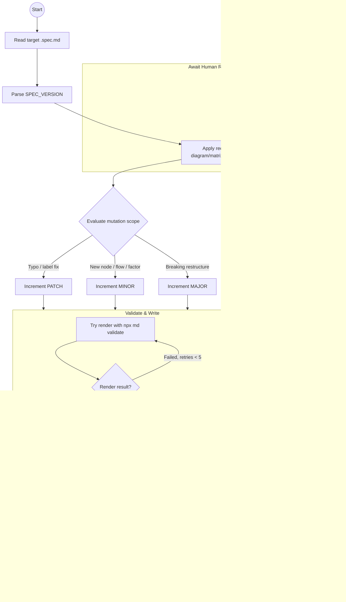
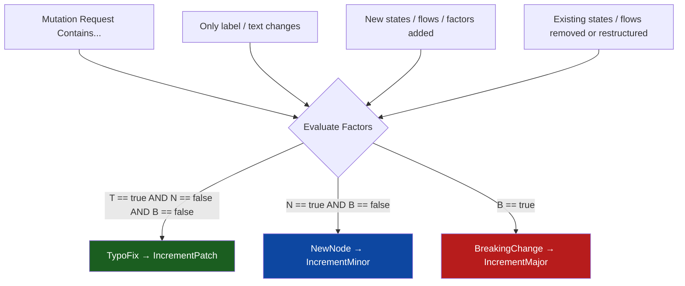

[ROLE: ARCHITECT] [STRICT CONTRACT]

```mermaid
%% @spec-version v1.3.2
graph TD
    Start((Start)) --> Read[Read target .spec.md]
    Read --> Parse[Parse SPEC_VERSION]
    Parse --> Apply[Apply requested diagram/matrix adjustments]
    Apply --> Scope{Evaluate mutation scope}

    Scope -->|Typo / label fix| PatchBump[Increment PATCH]
    Scope -->|New node / flow / factor| MinorBump[Increment MINOR]
    Scope -->|Breaking restructure| MajorBump[Increment MAJOR]

    PatchBump --> Validate
    MinorBump --> Validate
    MajorBump --> Validate

    subgraph Validate[Validate & Write]
        direction TB
        V1[Try render with npx md validate] --> V2{Render result?}
        V2 -->|Success| V3[Write to target path]
        V2 -->|Failed, retries < 5| V1
        V2 -->|Failed, retries >= 5| V4[[RENDER_FAILED]]
        V3 --> V5{Write result?}
        V5 -->|Success| V6[Proceed]
        V5 -->|Error| V7[[WRITE_ERROR]]
    end

    V6 --> Audit[Identify vulnerabilities and issues]
    Audit --> Review
    V4 --> Review
    V7 --> Review

    subgraph Review[Await Human Review]
        direction TB
        R1{Await decision}
        R1 -->|Approved| R2([End])
        R1 -->|Changes requested| Apply
        R1 -->|Aborted| R3([End])
    end
```

```mermaid
%% @spec-version v1.3.0
%% Decision Matrix for EvaluateScope: TypoFix vs NewNode vs BreakingChange
flowchart TD
    M[Mutation Request Contains...] --> A{Evaluate Factors}

    T[Only label / text changes] --> A
    N[New states / flows / factors added] --> A
    B[Existing states / flows removed or restructured] --> A

    A -->|"T == true AND N == false AND B == false"| Patch[TypoFix → IncrementPatch]
    A -->|"N == true AND B == false"| Minor[NewNode → IncrementMinor]
    A -->|"B == true"| Major[BreakingChange → IncrementMajor]

    style Patch fill:#1b5e20,color:#fff
    style Minor fill:#0d47a1,color:#fff
    style Major fill:#b71c1c,color:#fff
```
