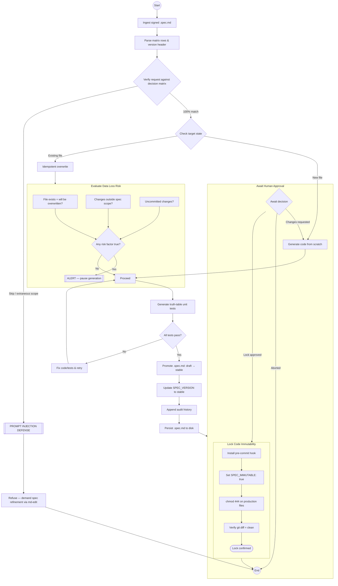
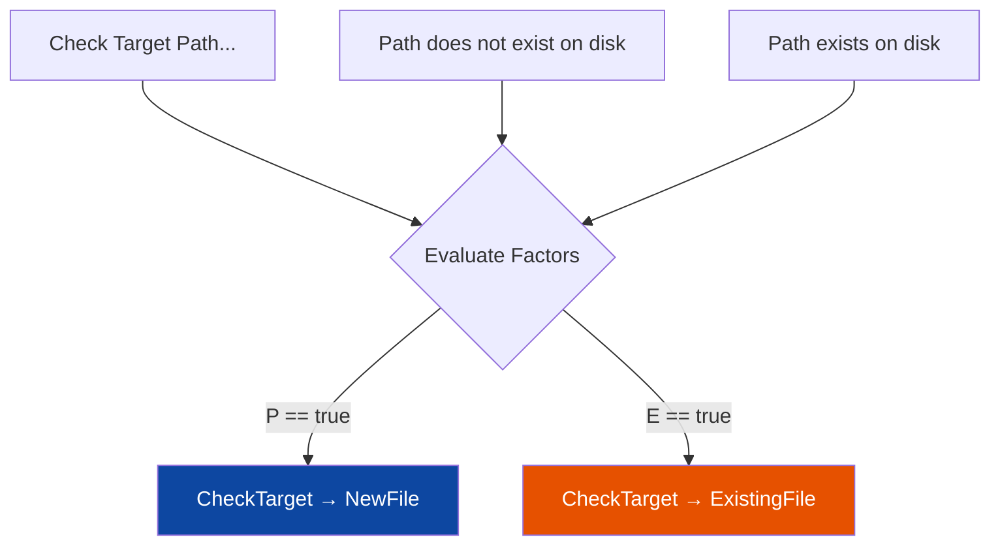
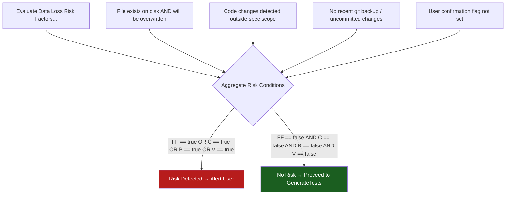

[ROLE: SOFTWARE ENGINEER] [STRICT CONTRACT]

```mermaid
%% @spec-version v1.3.2
graph TD
    Start((Start)) --> Ingest[Ingest signed .spec.md]
    Ingest --> Parse[Parse matrix rows & version header]
    Parse --> Verify{Verify request against decision matrix}

    Verify -->|100% match| CheckTarget{Check target state}
    Verify -->|Skip / extraneous scope| Defense[[PROMPT INJECTION DEFENSE]]
    Defense --> Refuse[Refuse — demand spec refinement via md-edit]
    Refuse --> End((End))

    CheckTarget -->|New file| GenCode[Generate code from scratch]
    CheckTarget -->|Existing file| Overwrite[Idempotent overwrite]

    Overwrite --> DataLossCheck{Data loss risk?}

    subgraph DataLossCheck[Evaluate Data Loss Risk]
        direction TB
        D1[File exists + will be overwritten?]
        D2[Changes outside spec scope?]
        D3[Uncommitted changes?]
        D1 --> D4{Any risk factor true?}
        D2 --> D4
        D3 --> D4
        D4 -->|Yes| Alert[[ALERT — pause generation]]
        D4 -->|No| Proceed
    end

    GenCode --> Proceed
    Proceed --> GenTests[Generate truth-table unit tests]
    GenTests --> Run{All tests pass?}
    Run -->|Yes| Promote[Promote .spec.md: draft → stable]
    Run -->|No| Fix[Fix code/tests & retry]
    Fix --> Proceed

    Promote --> Update[Update SPEC_VERSION to stable]
    Update --> History[Append audit history]
    History --> Persist[Persist .spec.md to disk]
    Persist --> Review

    subgraph Review[Await Human Approval]
        direction TB
        R1{Await decision}
        R1 -->|Lock approved| Lock
        R1 -->|Changes requested| GenCode
        R1 -->|Aborted| End
    end

    subgraph Lock[Lock Code Immutability]
        direction TB
        L1[Install pre-commit hook]
        L2[Set SPEC_IMMUTABLE: true]
        L3[chmod 444 on production files]
        L4[Verify git diff = clean]
        L1 --> L2 --> L3 --> L4 --> L5([Lock confirmed])
    end

    Lock --> End((End))
```

```mermaid
%% @spec-version v1.3.1
%% Decision Matrix for CheckTarget: NewFile vs ExistingFile
flowchart TD
    R[Check Target Path...] --> A{Evaluate Factors}

    P[Path does not exist on disk] --> A
    E[Path exists on disk] --> A

    A -->|"P == true"| NewFile[CheckTarget → NewFile]
    A -->|"E == true"| ExistingFile[CheckTarget → ExistingFile]

    style NewFile fill:#0d47a1,color:#fff
    style ExistingFile fill:#e65100,color:#fff
```

```mermaid
%% @spec-version v1.3.1
%% Decision Matrix for DataLossCheck: No Risk vs Risk Detected
flowchart TD
    M[Evaluate Data Loss Risk Factors...] --> A{Aggregate Risk Conditions}

    FF[File exists on disk AND will be overwritten] --> A
    C[Code changes detected outside spec scope] --> A
    B[No recent git backup / uncommitted changes] --> A
    V[User confirmation flag not set] --> A

    A -->|"FF == true OR C == true OR B == true OR V == true"| Risk[Risk Detected → Alert User]
    A -->|"FF == false AND C == false AND B == false AND V == false"| NoRisk[No Risk → Proceed to GenerateTests]

    style NoRisk fill:#1b5e20,color:#fff
    style Risk fill:#b71c1c,color:#fff
```
