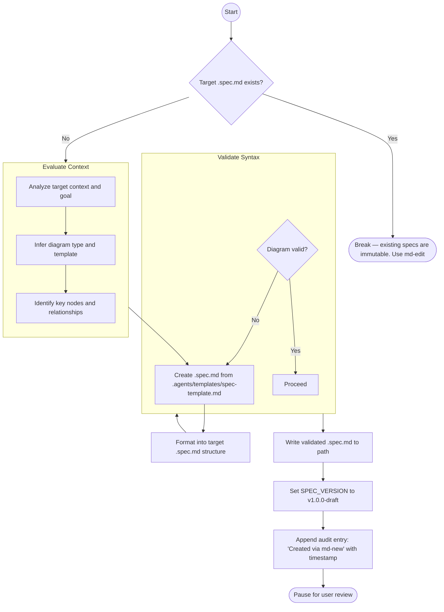

[ROLE: ARCHITECT] [STRICT CONTRACT]

```mermaid
%% @spec-version v1.3.2
graph TD
    Start((Start)) --> CheckTarget{Target .spec.md exists?}

    CheckTarget -->|Yes| Break([Break — existing specs are immutable. Use md-edit])
    CheckTarget -->|No| Evaluate

    subgraph Evaluate[Evaluate Context]
        direction TB
        E1[Analyze target context and goal]
        E1 --> E2[Infer diagram type and template]
        E2 --> E3[Identify key nodes and relationships]
    end

    Evaluate --> Blueprint[Create .spec.md from .agents/templates/spec-template.md]
    Blueprint --> Format[Format into target .spec.md structure]
    Format --> CheckDiagram

    subgraph CheckDiagram[Validate Syntax]
        direction TB
        C1{Diagram valid?}
        C1 -->|Yes| C2[Proceed]
        C1 -->|No| Blueprint
    end

    CheckDiagram --> Write[Write validated .spec.md to path]
    Write --> Init[Set SPEC_VERSION to v1.0.0-draft]
    Init --> Audit[Append audit entry: 'Created via md-new' with timestamp]
    Audit --> Review([Pause for user review])
```
