[ROLE: ARCHITECT] [STRICT CONTRACT]

```mermaid
%% @spec-version v2.2.0
stateDiagram-v2
    [*] --> LoadMermaidSkill

    LoadMermaidSkill --> SelfScan: Consume mermaid-diagrams skill to learn diagram types
    SelfScan --> Classify: Walk the project tree and discover .spec.md files

    state Classify {
        [*] --> DetectMacros: Find .spec.md at project root → MACRO specs (domains)
        DetectMacros --> DetectMicros: Find .spec.md in subfolders → MICRO specs (components)
        DetectMicros --> IdentifyActors: From spec content, identify users and external systems
    }

    Classify --> ReadSpecs: Read each spec to understand domain, components, and integrations
    ReadSpecs --> PlanDiagram: Plan a multi-level flowchart LR
    PlanDiagram --> ComposeDiagram: Compose flowchart LR with subgraphs, components, actors, edges, classes

    state ComposeDiagram {
        [*] --> BuildSubgraphs: One subgraph per MACRO domain with its MICRO components inside
        BuildSubgraphs --> AddActors: Add users and external systems OUTSIDE subgraphs
        AddActors --> AddEdges: Connect nodes with labeled arrows (uses, calls, deploys, integrates)
        AddEdges --> AddClasses: Apply classDef for system / user / external / infra distinction
    }

    ComposeDiagram --> ValidateDiagram: Run `npx md validate <output>.md` until valid
    ValidateDiagram --> WriteArtifact: Save to ARCHITECTURE.spec.md (or similar) at project root
    WriteArtifact --> [*]
```



## Purpose

The `mddd-context-map` skill teaches the agent to produce a **product architecture diagram** that visualizes the system at **multiple levels**:

- **Macro areas (domains)** — each MACRO spec represents a high-level domain.
- **Micro components / services** — MICRO specs are the building blocks inside each domain.
- **Data flows** between users, UI, backend, serverless functions, and external infrastructure.

The output is a stylized **flowchart LR** that combines domain grouping with internal components and external integrations, emphasizing the user journey, backend orchestration, and the infrastructure layer.

> **v2.0.0** rewrites the skill to produce a **multi-level product architecture diagram** (C4-inspired but as `flowchart LR` with classDef styling), instead of the previous C4-only recommendation. The skill now drives a richer, more prescriptive output that mirrors how product teams sketch architecture on a whiteboard.

## Conceptual Model

```
Users / External Systems              MACRO Domain 1               MACRO Domain 2
   (outside subgraphs)               (subgraph)                   (subgraph)
                                    ┌──────────────┐             ┌──────────────┐
   👤 User  ───uses───▶              │  Component A │             │  Component X │
                                    │  Component B │             │  Component Y │
   🌐 External API  ──integrates──▶  │  Component C │             │  Component Z │
                                    └──────────────┘             └──────────────┘
                                            │                            │
                                            └───calls──────┬─────────────┘
                                                            ▼
                                                    Database / Infra
```

## Multi-Level Architecture Diagram Spec

### 1. Type and direction

- **Type**: `flowchart LR` (left-to-right). Use `graph LR` if `flowchart` is not supported.
- **Why LR**: the user journey reads left → right, the way most product architecture diagrams are drawn.

### 2. Subgraphs (one per MACRO domain)

- For every **MACRO spec** found, create **one `subgraph`** named after the domain.
- Each subgraph contains the **MICRO components** that belong to that domain, based on explicit domain relationships and spec content rather than file path or folder depth.
- When a MICRO spec does not explicitly name its domain, infer it from the domain language and the surrounding feature relationship, not from where the file is stored.
- The subgraph should have a clear, domain-level label (e.g. `subgraph webApp["🌐 Web App"]`).

### 3. Nodes (components, users, external systems)

- Inside each subgraph, list the **functional components** as **textual nodes**:
  - `compA["⚙️ Component A<br/>(short role)"]:::systemNode`
- **Users** and **external systems** are placed **outside** all subgraphs:
  - `user((👤 End User)):::userNode`
  - `external[[🌐 External API]]:::externalNode`
- Use emojis at the start of node labels to make the diagram scannable.

### 4. Edges (labeled flows)

Every meaningful connection is a **labeled arrow**:

| Edge type | Label convention | Example |
| :--- | :--- | :--- |
| User → UI | `"uses"` | `user -->|"uses"| ui` |
| UI → Backend | `"calls API"` | `ui -->|"calls API"| api` |
| Backend → Serverless | `"invokes"` | `api -->|"invokes"| fn` |
| Service → Database | `"reads/writes"` | `svc -->|"reads/writes"| db` |
| Service → External API | `"integrates with"` | `svc -->|"integrates with"| ext` |
| CI/CD → Service | `"deploys"` | `cicd -->|"deploys"| svc` |
| Service → Queue | `"publishes"` | `svc -->|"publishes"| queue` |

Always choose the verb that best matches the *intent* of the connection.

### 5. ClassDef styling (visual hierarchy)

Apply at least these `classDef` rules to differentiate the kinds of nodes:

```
classDef userNode     fill:#fef3c7,stroke:#b45309,stroke-width:2px,color:#1f2937;
classDef systemNode   fill:#1e3a8a,stroke:#1e40af,stroke-width:2px,color:#fff;
classDef externalNode fill:#7c2d12,stroke:#9a3412,stroke-width:2px,color:#fff;
classDef infraNode    fill:#374151,stroke:#4b5563,stroke-width:1px,color:#fff,font-style:italic;
```

| Class | When to use | Visual feel |
| :--- | :--- | :--- |
| `userNode` | People, personas, roles | Warm, friendly (yellow) |
| `systemNode` | Internal services / components | Strong, professional (blue) |
| `externalNode` | Third-party APIs, partner systems | Stand-out (red-orange) |
| `infraNode` | Databases, queues, caches, storage | Subdued, italic (gray) |

### 6. Class assignment

After creating the subgraphs and nodes, apply the classes:

```
class user1,user2 userNode
class svcA,svcB,svcC systemNode
class extApi,partnerX externalNode
class db,queue,cache infraNode
```

Or attach the class inline with `:::className` on each node.

## Self-Scan Discovery Workflow

1. **Walk the project tree** from the current working directory, recursively finding every `.spec.md`. You MUST use the CLI command `npx md list-specs` to obtain the authoritative list. Prune `node_modules`, `.git`, `.agents`, `build`, `dist`.
2. **Classify** each spec by its content and role, not by directory depth or file location:
   - specs that describe broad product domains, business capabilities, or top-level architectural scopes → **MACRO**
   - specs that describe individual components, services, features, or implementation units → **MICRO**
   - use explicit domain labels, architecture language, and the spec's intent to distinguish MACRO from MICRO
3. **Read each spec** to understand its purpose, role, and relationships. Do not generate a diagram from filenames or folder structure alone.
4. **Identify actors and external systems** by scanning the spec content for keywords:
   - `user`, `customer`, `admin`, `developer`, `operator` → **userNode**
   - `external API`, `third-party`, `partner`, `OAuth`, `Stripe`, `AWS S3` → **externalNode**
   - `database`, `DB`, `PostgreSQL`, `MySQL`, `Redis`, `queue`, `Kafka`, `S3` → **infraNode**
5. **Infer edges** by looking for verbs and references between specs (e.g. one MICRO mentions "calls into X" or "publishes to Y").
6. **Compose the diagram** following the spec above.
7. **Validate** with `npx md validate` and iterate until the diagram is valid.
8. **Write the artifact** to `ARCHITECTURE.spec.md` (or `CONTEXT_MAP.md`) at the project root.

## Output Artifact

The skill should write the result to `ARCHITECTURE.spec.md` (or `CONTEXT_MAP.md`) at the project root, inside a `mermaid` code fence. The agent must:

1. Use the **`npx md validate <path>`** command to ensure the diagram is syntactically valid.
2. Include `click` directives linking each internal node to its spec file (cross-platform navigability).
3. Add a short human-readable caption above the diagram summarizing:
   - How many MACROs and MICROs were mapped
   - Which external systems are integrated
   - Which infrastructure layer is used

## Output Template (v2.2.0 — diagram-first, strict)

The skill ships a **rigid reference template** that the agent **must** follow section by section. The template is **diagram-first**: every section uses Mermaid diagrams or decision-matrix tables, so the LLM has minimal free-form prose to interpret.

- **Template path:** `.agents/templates/ARCHITECTURE.template.md` (copied by `md init`).
- **Structure (8 sections, in this exact order):**

| § | Section | What goes there |
| :---: | :--- | :--- |
| 1 | Topology Overview (`flowchart LR`) | One-glance diagram: actors + externals + subgraphs + infra + edges + classDef |
| 2 | MACRO Decision Matrices | One truth-table per MACRO, factor columns pulled from each `*.spec.md` |
| 3 | Cross-Domain Data Flow Diagrams | One `sequenceDiagram` per major flow (auth, CRUD, payment, deploy) |
| 4 | External Integrations (`graph LR`) | Focused diagram of every third-party system |
| 5 | Infrastructure Topology (`graph TB`) | Stand-alone top-down diagram of infra |
| 6 | Component Dependency Matrix | Compact truth-table: from / to / label / trigger / source spec |
| 8 | Generation Footer | Counts + validation status |

### Strict substitution rules

1. **Every `{{PLACEHOLDER}}` must be substituted.** If a section has no data, emit a single Mermaid block showing `(empty — no X found)` — do not delete the section.
2. **Do not reorder sections.** The order is part of the contract.
3. **Do not add free-form prose outside the labeled slots.** Express everything as diagrams or tables.
4. **Decision matrices in §2 are truth-tables**, not paragraphs. Reproduce the Primitive Factors columns from each MACRO's `*.spec.md` exactly.
5. **Sequence diagrams in §3 are time-ordered**, not topology. One section per main user/system flow.
6. **The §6 Component Dependency Matrix is the source of truth for edges** — §1 and §4 and §5 should be consistent with it.

### How to use the template

1. **Read `.agents/templates/ARCHITECTURE.template.md`** to see the 8 sections.
2. **Walk the project** and read every `.spec.md` to extract:
   - MACRO domains + their decision matrix factors
   - MICRO components per MACRO
   - External systems (keyword scan: `external`, `third-party`, `OAuth`, `Stripe`, `AWS S3`, `Gemini`, etc.)
   - Infrastructure (keyword scan: `database`, `PostgreSQL`, `MySQL`, `Redis`, `queue`, `Kafka`, `S3`, `Secret Manager`)
   - Main flows (auth, CRUD, payment, deploy) by reading the verbs in each spec
3. **Substitute every placeholder** in template order.
4. **Validate** with `npx md validate` and iterate until every diagram parses.
5. **Write** to `ARCHITECTURE.spec.md` at the project root.

## Hard Rules

- **Never** invent edges that are not grounded in the specs.
- **Always** put users and external systems **outside** the subgraphs (they are not domains of the product).
- **Always** apply classDef styling to differentiate the four node kinds.
- **Always** label every edge with a verb that conveys intent (`uses`, `calls`, `invokes`, `reads`, `writes`, `integrates with`, `deploys`, `publishes`).
- **Always** use `flowchart LR` (left-to-right) so the user journey reads naturally.
- **Always** preserve `click` directives for internal nodes pointing to their spec files.
- **Always** validate the resulting Mermaid diagram with `npx md validate` before declaring success.
- **Always** perform the file discovery yourself with `node:fs` (or any recursive walker) — do not assume the existence of a `md map` CLI command, which has been removed.
- **Always** use the `md list-specs` command as the authoritative source of all `.spec.md` files in the project before building the architecture map.

## References

- `mermaid-diagrams` skill — for the full catalog of Mermaid diagram types and their syntax.
- `md-audit` skill — for the broader MDDD workflow this skill slots into.
