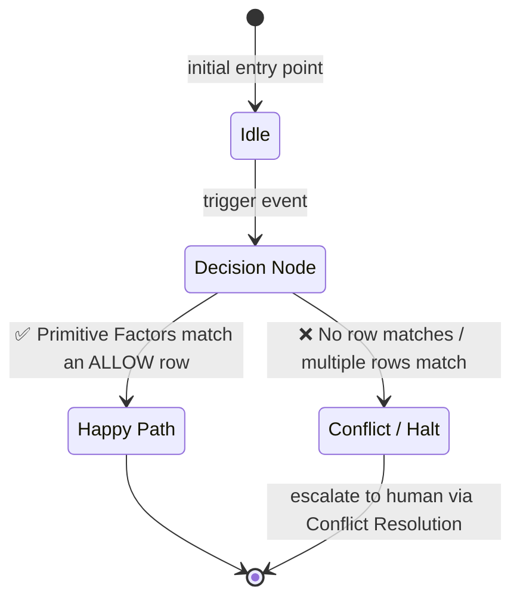

**SPEC_VERSION:** v1.0.0 — draft|stable

# {{Feature Title}} — Specification

> ⚠️ **This is a freshly generated MDDD spec template.**
> Replace every `{{placeholder}}`, remove this banner, and refine the diagram + matrix with the real business context. Only mark the spec as `stable` if it's coese and reflecting the real code.

---

## 1. Behavioral Flow (Mermaid)

> Pick the diagram type that best fits the topology using mermaid-diagrams skill.

**Replace the diagram above with the real topology** for this feature.
Every node MUST correspond to a concrete state, action, or decision found in the Decision Matrix.

---

## 2. Decision Matrix

The matrix below is the **deterministic truth table** that resolves the flow above.
Each row maps a combination of **Primitive Factors** → a `Action` → `States/Validations(✅|❌)` → `Result`.

**Resolution rules** (per MDDD protocol):

1. ALL columns must match a system state.
2. If no row fully matches → `HaltWithConflict`.
3. If multiple rows match → `HaltWithConflict`.

---

## 3. Tasks

Atomic, executable checklist. Each item MUST be traceable
back to a node in the Behavioral Flow or a row in the Decision Matrix.

- [ ] {{Task X — derived from flow node / matrix row}}
- [ ] {{Task X+1 — derived from flow node / matrix row}}

---

## 4 Test plan

Atomic, executable test checklist to be implemented covering edge-cases.

- [ ] {{Test X — Use case/Scenario covered}}
- [ ] {{Test X+1 — Use case/Scenario covered}}

---

## 5. Conflict Resolution Notes

When a `HaltWithConflict` is triggered, document the resolution path here:

| Conflict Source | Proposed Matrix Change | Status |
| :--- | :--- | :---: |
| {{Primitive Factor that caused the halt}} | {{new row / new column / renamed state}} | `OPEN` / `RESOLVED` |

___

## 6. Audit History

Click to expand

| Date | Version | Change Short Tech-Summary |
| :--- | :---: | :--- |
| {{YYYY-MM-DD}} | v1.0.0 | Short tech explain of what changed. Status: `draft\|stable`. |

