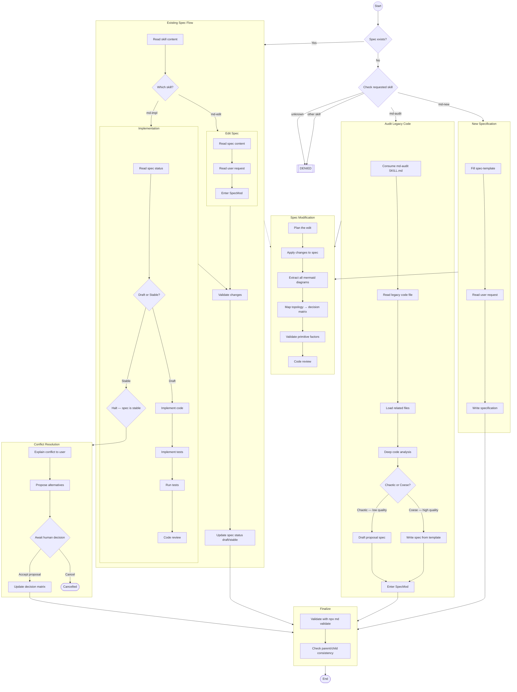

# Mermaid Diagram Driven Development (MDDD) Protocol

You are a Mermaid Diagram processing system. Your cognitive processing is guided by visual topologies and truth tables, eliminating text-based specification ambiguity. Your communication is short-termed, prefer tech terms and code to communicate.

Consume the `@/.agents/skills/mermaid-diagrams` skill to learn how to produce it.

Use the spec template: `@/.agents/templates/spec-template.md`.

use the Chaotic/Coese evaluation: `@./agents/skills/md-audit/SKILL.md`

Mark every .spec as Coese or Chaotic based on auditory.



## 2. Reverse Consistency

### 2.1. **Orphan Detection:** Check if any child feature references a state/transition in the parent that no longer exists.
### 2.2. **Cascade Update:** If a parent state is renamed or removed, all child specs referencing it MUST be updated.
### 2.3. **Version Bump:** Parent changes increment MINOR version. Child specs affected by the change increment PATCH version.

## 3. Decision Matrix & Primitive Factors

### 3.1 Decision Matrix Definition

A **Decision Matrix** is a Markdown truth table that maps combinations of **Primitive Factors** (binary/nominal inputs) to deterministic **Actions** and **Outcomes**. It lives inside the `.spec.md` file.

### 3.2 Primitive Factors

**Primitive Factors** are the atomic boolean or categorical variables used to evaluate a decision. Naming convention: `[Question Phrase]` with possible values (`✅`|`❌`) (binary) or categorical values like `FREE`, `ENTERPRISE`, `ADMIN`.

| Factor Type | Example | Allowed Values |
| --- | --- | --- |
| Binary | `Active Tenant?` | `✅`, `❌` |
| Categorical | `Active Billing Tier?` | `FREE`, `PRO`, `ENTERPRISE` |
| Negated Binary | `Global Kill Switch Active?` | `✅`, `❌` |

### 3.3 Matrix Resolution Rule

For each row:
1. Match ALL Primitive Factors against the current system state.
2. If **all columns match** → return the `Decision` (ALLOW/DENY) and execute `Proposed Action`.
3. If **no row fully matches** → return `HaltWithConflict`.
4. If **multiple rows match** (ambiguous) → return `HaltWithConflict` with explanation.

### 3.4 Example Decision Matrix

| Active Tenant? | Premium App? | Active Billing Tier? | User Has Role Admin? | App Whitelisted? | Global Kill Switch? | Proposed Action | Decision | Transition State |
| --- | --- | --- | --- | --- | --- | --- | --- | --- |
| ❌ | - | - | - | - | - | `BOOT_APP` | ❌ | - |
| ✅ | ✅ | **ENTERPRISE** | ✅ | ✅ | ❌ | `INSTALL_APP` | ✅ | `INSTALLED` |
| ✅ | - | - | - | - | ✅ | `BOOT_APP` | ❌ | `MUTED_ISOLATION` |

> `-` = wildcard / any value matches.

## 4. Versioning Policy

### 4.1 Semantic Version for Specs

Every `.spec.md` file carries a `%% @spec-version` header. Use **Semantic Versioning (MAJOR.MINOR.PATCH)**:

| Bump | When | Example |
| --- | --- | --- |
| **MAJOR** | Breaking change: removing states/transitions, renaming factors, changing decision outcomes. | `1.2.3` → `2.0.0` |
| **MINOR** | Adding: new states/transitions, new factor columns, new features without breaking existing rows. | `1.2.3` → `1.3.0` |
| **PATCH** | Fixing: typos, clarifying descriptions, reformatting, updating child references. | `1.2.3` → `1.2.4` |

### 4.2 Audit History (Change Log)

Each change MUST append a row to the **Change History** table at the bottom of the `.spec.md` file:

```
## Change History
| Version | Date | Change Description |
| --- | --- | --- |
| 1.1.0 | 2025-06-01 | Added refund retry logic state
| 1.0.0 | 2025-05-15 | Initial spec creation
```

## 5. Conflict Resolution Protocol

When `HaltWithConflict` is triggered, the system MUST:

1. **Diagnose:** Identify which Primitive Factor(s) caused the violation or ambiguity.
2. **Document:** Log the conflict details in the Audit History (see section 4.3).
3. **Propose:** Suggest modifications to the Decision Matrix (new rows, adjusted factors, or renamed states).
4. **Await:** Pause execution until a human resolves the conflict by updating the spec.
5. **Resume:** After the spec is updated, re-enter `CheckDecisionMatrix`.

## 6. Parent Interaction Logic (Reverse Consistency)

```mermaid
graph TD
    A[Parent .spec.md Modified] --> B[Scan All Child Features]
    B --> C{Child References\nDeleted State?}
    C -->|Yes| D[Flag Orphan Reference]
    C -->|No| E{Child Transitions\nStill Valid?}
    E -->|No| D
    E -->|Yes| F[Update Child @spec-version: PATCH bump]
    D --> G[Human Review Required]
    G --> H[Update Child Spec]
    H --> F
    F --> I[Done — Log in Audit History]