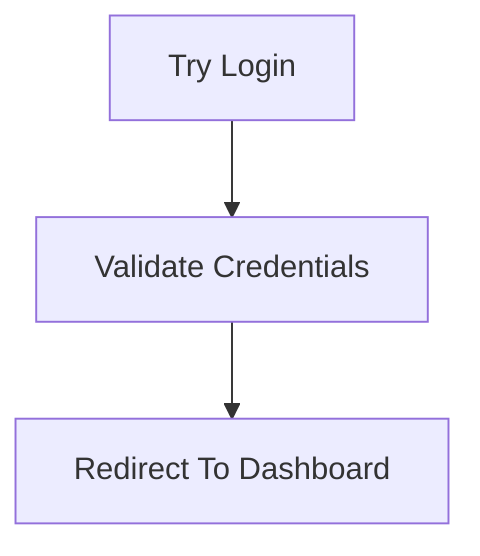

# MDDD Hover Extension

Extensão VS Code que exibe diagramas Mermaid ao fazer hover em comentários `//@ID`.

## Funcionalidades

- Detecta comentários no formato `//@ID` (ex: `//@Login1.1`)
- Identifica automaticamente o identificador (classe/função/variável) na linha imediatamente abaixo
- Transforma nomes camelCase/snake_case em labels legíveis (ex: `_tryLogin` → `Try Login`)
- Escaneia o arquivo em busca de todas as tags relacionadas pelo prefixo
- Gera diagrama Mermaid `graph TD` conectando as entidades hierarquicamente
- Exibe o diagrama diretamente no hover do VS Code (renderização nativa de Mermaid)

## Como usar

1. Instale as dependências: `npm install`
2. Compile o projeto: `npm run compile`
3. Abra o projeto no VS Code e pressione `F5` para iniciar a extensão em modo de desenvolvimento
4. Em um arquivo de código, adicione comentários no formato `//@ID`:

```typescript
//@Login1.1
function _tryLogin() {
    // código
}

//@Login1.2
function _validateCredentials() {
    // código
}

//@Login1.3
function _redirectToDashboard() {
    // código
}
```

5. Faça hover sobre qualquer comentário `//@Login*` para ver o diagrama Mermaid com todas as tags relacionadas

## Exemplo de saída

Ao fazer hover em `//@Login1.1`, a extensão exibirá:

```
Tag: //@Login1.1
Prefixo: Login
Tags relacionadas: 3

---


```

## Estrutura do projeto

```
mddd-extension/
├── package.json          # Configuração da extensão
├── tsconfig.json         # Configuração TypeScript
├── extension.ts          # Código principal da extensão
├── out/
│   └── extension.js      # Código compilado
└── README.md            # Este arquivo
```

## Tecnologias

- TypeScript
- VS Code Extension API
- Mermaid (renderização nativa do VS Code)

## Licença

MIT