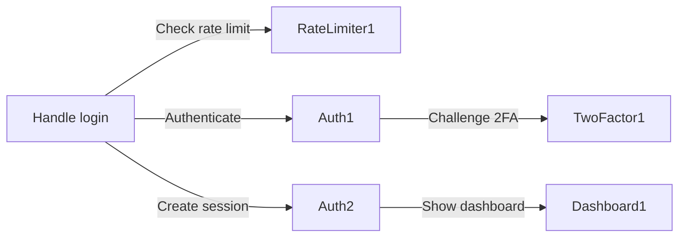

<p align="center">
  
</p>

<h1 align="center">MAD — Mermaid Auto-Doccing</h1>

<p align="center">
  <strong>Replace <code>// description</code> comments with <code>//@</code> tags.<br>Your code stays readable. Enriched with diagrams.</strong>
</p>

---

## Why?

Documentation rots. Diagrams drift. When your architecture diagram lives in Confluence or a wiki, it's outdated the moment you commit.

**MAD inverts the problem:** put the diagram *inside* the code. `//@` tags replace your plain `// description` comments — same line position, same readability, but now they double as machine-readable documentation. Tags sit directly above what they describe: classes, methods, branches, error paths. Save the file and MAD generates a valid Mermaid diagram. No context-switching. No manual diagramming. Documentation that can't fall out of sync because it *is* the code.

---

## See it in action

Here's a login controller. The `//@` tags on the left replace regular comments. The diagram on the right is what MAD generates — automatically, on save.

<table>
<tr>
<th width="50%">Your code with MAD tags</th>
<th width="50%">Rendered diagram</th>
</tr>
<tr>
<td>

```typescript
//@::graph LR

//@Entry
class LoginController {
  //@Entry1:Handle login
  async handleLogin(email, password, ip) {
    //@->RateLimiter1:Check rate limit
    const allowed = await rateLimiter.check(ip);
    if (!allowed) return error.tooManyRequests();

    //@->Auth1:Authenticate
    const user = await auth.authenticate(email, password);
    if (!user) return error.invalidCredentials();

    if (user.twoFactorEnabled) {
      //@->TwoFactor1:Challenge 2FA
      return twoFactor.initiateChallenge(user);
    }

    //@->Auth2:Create session
    const session = await auth.createSession(user);
    //@->Dashboard1:Show dashboard
    return send.success(session);
  }
}

//@Auth
class AuthService {
  //@Auth1:Authenticate
  async authenticate(email, password) { … }
  //@Auth2:Create session
  async createSession(user) { … }
}
```

</td>
<td>



</td>
</tr>
</table>

Every `//@Group` becomes a subgraph. Every `//@Group1:Label` becomes a node. Every `//@->Target:Label` becomes an edge. What you see in the diagram is *exactly* what the code does — every branch, every error path, every external call.

---

## How it works

```
 You write                  MAD parses                  You get
─────────────            ─────────────────          ─────────────────
 //@Auth                Auth  → subgraph node       Live Mermaid diagram
 //@Auth1:Login         Auth1 → step node           in a preview panel
 //@->Db1:Save           Auth → Db1 edge            with full controls
```

### How you interact with MAD

| Surface | What happens |
|---|---|
| **Hover** | Hover over any `//@` tag to see its properties — target, label, line references |
| **Click** | Click a `//@` tag to open the diagram in a preview panel with zoom, two-finger pan, search, and export |
| **Save** | Save the file — MAD generates the full diagram to `/tmp/mad-diagram.mermaid` |
| **CLI agents** | Agents call `POST /validate` on MAD's local HTTP server to retrieve and validate diagrams |

---

## Supported diagrams

Add a `//@::` directive anywhere in your file to declare the diagram type.

| Directive | Diagram | Best for |
|---|---|---|
| `//@::graph` | Flowchart (top-down) | Control flow, algorithms, process steps — **this is the default** |
| `//@::graph LR` | Flowchart (left-to-right) | Wider flows, horizontal layouts |
| `//@::sequenceDiagram` | Sequence | API calls, message passing, event chains |
| `//@::classDiagram` | Class diagram | OOP modeling, domain models, inheritance |
| `//@::stateDiagram-v2` | State machine | States, transitions, workflows |
| `//@::erDiagram` | Entity-relationship | Database schemas, entity relationships |

---

## Benefits that compound

| Benefit | Why it matters |
|---|---|
| **Replace, don't add** | `//@` tags replace your existing `// description` comments — no extra lines in your code |
| **Zero context-switching** | No external tool. Write tags, save, open the diagram |
| **100% coverage enforcement** | Missing paths are visible as missing nodes in the diagram |
| **Agent-friendly** | Local HTTP server lets Cline, Roo Code, and other CLI agents validate and read diagrams |
| **Language-agnostic** | Works with JavaScript, TypeScript, Python, Java, C#, Go, Rust, PHP, Dart, Ruby, Swift, Kotlin, Scala, C, C++, and SQL |

---

## Agent integration

MAD runs a local HTTP server (`127.0.0.1` only) that CLI agents can call:

```bash
# Health check
curl http://127.0.0.1:$(cat /tmp/mad-server.port)/health
# → {"status":"ok","version":"1.7.14"}

# Validate a file and get its diagram
curl -X POST http://127.0.0.1:$(cat /tmp/mad-server.port)/validate \
  -H 'Content-Type: application/json' \
  -d '{"filePath":"/path/to/file.ts"}'
# → {"status":"ok","mermaidCode":"graph LR\n  ...","warnings":[]}
```

Agents use this to read your architecture, validate MAD tags, and keep a better understanding of your codebase.

---

## Core rules (one sentence each)

- **Replace your `//` comments with `//@` tags** — same position, same readability, now diagramed!
- **One tag per code line** — declaration (`//@Name`), connection (`//@->Target`), or both (`//@Name->Target`) but not stacked
- **Document every code path** — every method, every branch, every error, every external call
- **Use numbered hierarchy** — `Group1` for entry points, `Group1.1` for sub-steps
- **Connections live above the source** — `//@->Target:Label` goes on the line above the code that *makes* the call

---

## Quick start

### 1. Install the extension

Install **MAD** from the VS Code Marketplace in any VS Code-derived IDE (VS Code, Cursor, Windsurf, etc.).

### 2. Install the skill

Your agent needs the MAD skill to understand `//@` syntax:

```bash
npx skills add juliocrfilho/mad
```

This installs `.agents/skills/mad/SKILL.md` — the reference your agent uses to write valid MAD tags.

### 3. Tell your agent to use it

Say to your agent:

> "Document this file with MAD tags using the mad skill."

The agent will read the skill, scan your code, and add `//@` tags above every class, method, branch, and external call. Save the file and your diagram is ready.

---

## Running tests

```bash
npm test
# → 29 tests, 0 failures across 6 diagram-type suites
```

Update snapshots after diagram changes:

```bash
NODE_PATH=test/mocks node --test-update-snapshots --test test/mad-outputs.test.mjs
```

---

## Extension settings

| Setting | Default | Description |
|---|---|---|
| `mad.server.enabled` | `true` | Start the local HTTP server for agent access |
| `mad.server.port` | `0` | Server port (`0` = auto-assign) |
| `mad.disableFormatOnSave` | `false` | Disable `formatOnSave` when MAD tags are detected |
| `mad.showFormatWarning` | `true` | Warn if auto-formatter may break `//@` tags |

---

## Architecture

MAD itself is documented with MAD tags. Open `extension.ts` — every step of the activation sequence is tagged with `//@Setup1` through `//@Setup24`. Save the file and MAD generates its own flowchart.

---

## License

MIT