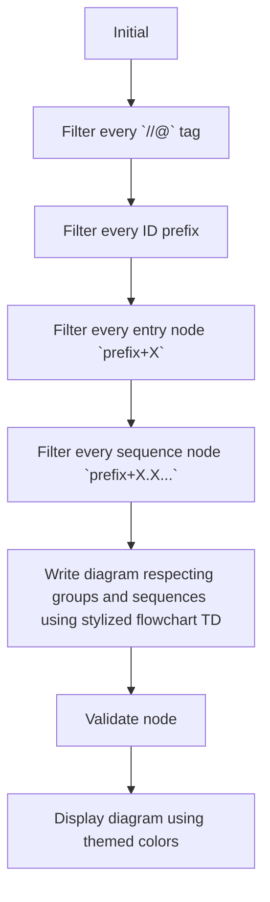

```mermaid
    flowchart TD

    Initial --> FilterTags[Filter every `//@` tag]
    FilterTags --> FilterGroups[Filter every ID prefix]
    FilterGroups --> FilterNodes[Filter every entry node `prefix+X`]
    FilterNodes --> FilterSequences[Filter every sequence node `prefix+X.X...`]
    FilterSequences --> WriteDiagram[Write diagram respecting groups and sequences using stylized flowchart TD] --> Validate[Validate node]
    Validate --> Display[Display diagram using themed colors]
```